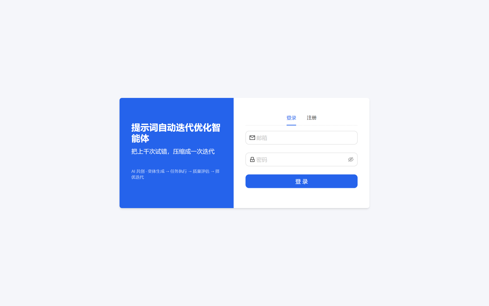
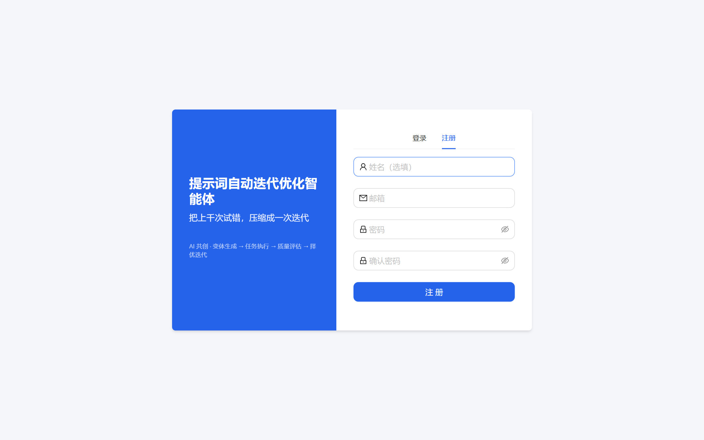
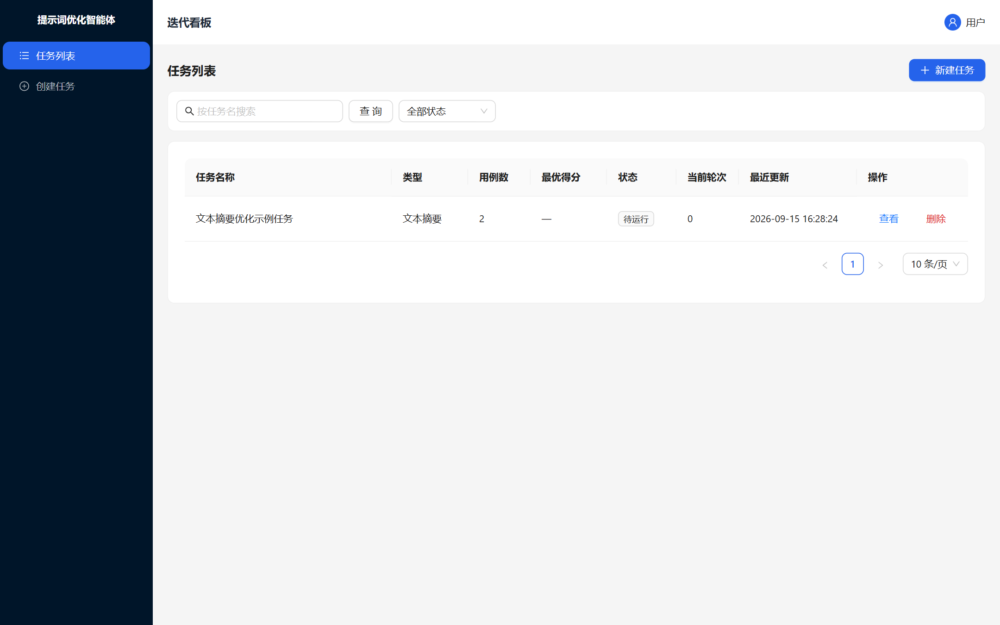
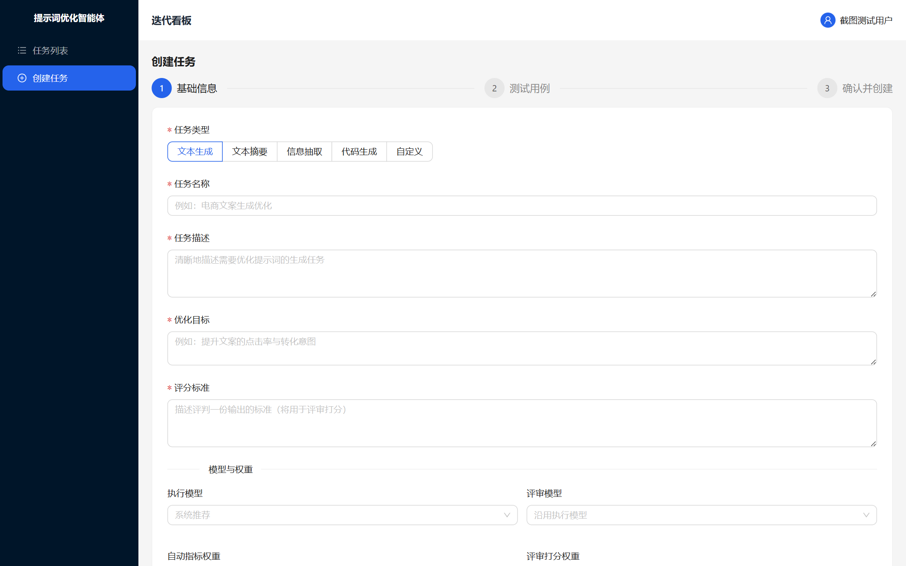
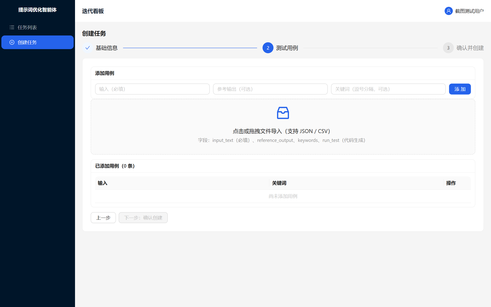
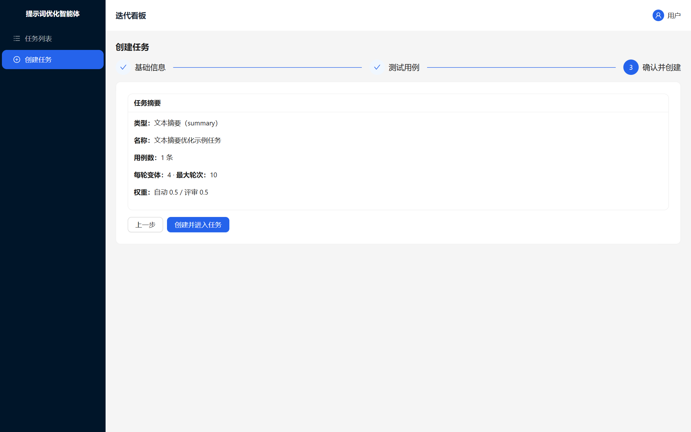
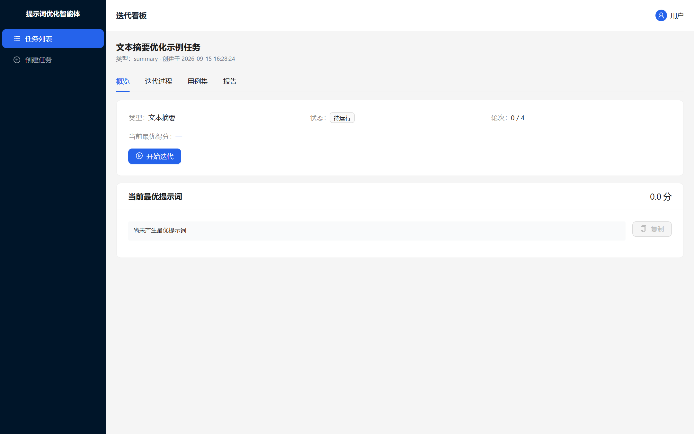
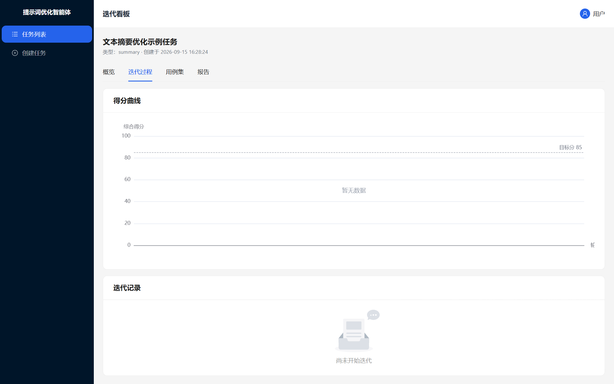
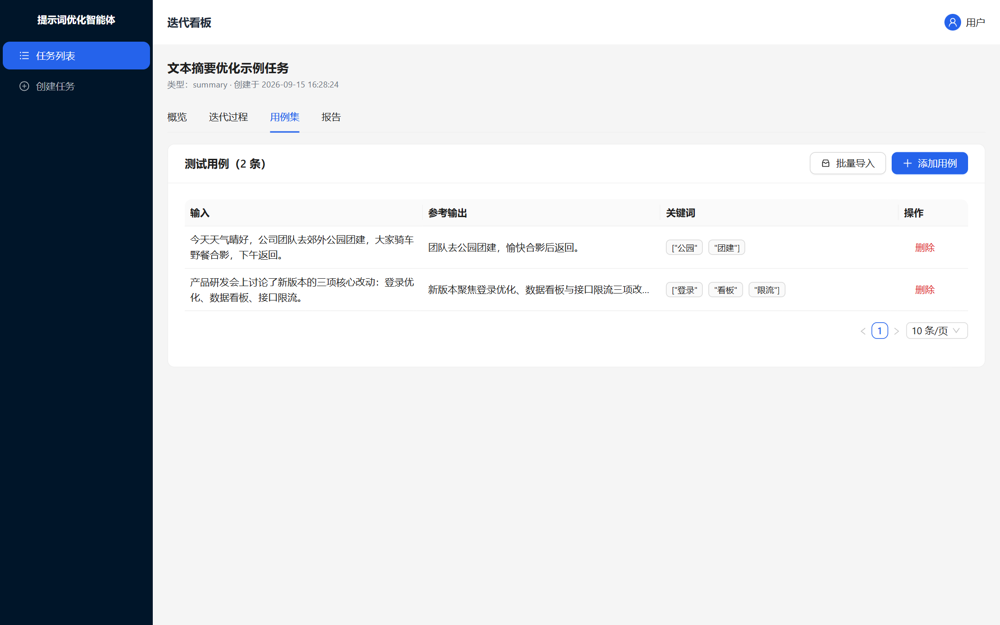
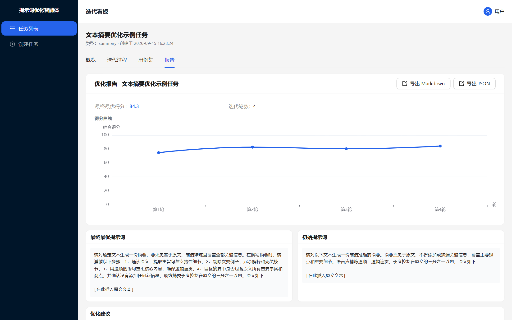

# 实训04 前端开发

## 一、实训目标

1. 掌握基于 React 18 + TypeScript + Vite 的现代前端项目搭建流程
2. 理解前后端分离架构下的跨域代理配置与 API 调用封装
3. 学会使用 Ant Design 5 + TailwindCSS，并在「皇家蓝作品集风格」视觉基线下构建统一界面
4. 掌握 Zustand 全局状态管理在认证场景中的应用
5. 能够独立运行并验证本项目全部 14 个前端页面功能：登录、仪表盘、任务列表、三步创建、多 Tab 详情、模型评测、知识库、在线服务、工作流、分享中心、公开报告、管理员日志/用户管理等

## 二、实训内容

### 1. 背景知识

本项目采用前后端分离的 B/S 架构，前端负责界面交互、状态管理与 API 调用，后端提供 RESTful JSON 接口与 AI 迭代计算能力。本实训聚焦前端工程搭建与功能验证，技术栈：

- **框架与语言**：React 18 + TypeScript 5 + Vite
- **UI 组件库**：Ant Design 5 + TailwindCSS 原子化样式
- **视觉风格**：皇家蓝作品集风格（V2.0，见 UI/UX 设计文档）——重点落地皇家蓝 `#0E4AC3` 实心块选中态、超大黑色中英对照标题、点前缀序号 `·01`、1px 细线与浅灰底 `#E9E9EB`
- **状态管理**：Zustand（轻量、易调试）
- **路由**：React Router v6
- **可视化**：ECharts 5（得分曲线）
- **HTTP 客户端**：Axios（统一拦截、错误处理、token 注入）

开发服务器默认端口 5173，生产构建产物输出到 `dist` 目录，由后端静态文件托管（端口 8000）。

### 2. 项目结构

```
d:\trae_project\提示词自动迭代优化智能体\01.code\prompt_optimizer\frontend
├── index.html                # Vite 入口 HTML
├── package.json             # 依赖清单与脚本
├── tsconfig.json            # TypeScript 配置
├── vite.config.ts           # Vite 构建配置（含代理）
├── tailwind.config.js       # TailwindCSS 配置
├── postcss.config.js        # PostCSS 配置
├── src/
│   ├── main.tsx             # React 入口
│   ├── App.tsx              # 根组件与路由
│   ├── index.css            # 全局样式（引入 Tailwind）
│   ├── vite-env.d.ts        # Vite 环境类型声明
│   ├── api/                 # 各模块接口封装（统一走 Axios 实例）
│   │   ├── http.ts          # Axios 实例 + 拦截器（统一错误处理）
│   │   ├── auth.ts          # 认证接口
│   │   ├── task.ts          # 任务/用例/迭代/评测接口
│   │   ├── admin.ts         # 管理员接口
│   │   ├── dashboard.ts     # 仪表盘统计接口
│   │   ├── knowledge.ts     # 知识库（RAG）接口
│   │   ├── endpoint.ts      # 在线服务端点/密钥/调用日志接口
│   │   ├── workflow.ts      # 多步骤工作流接口
│   │   └── reportShare.ts   # 报告分享接口
│   ├── types/
│   │   └── index.ts         # 全局 TypeScript 类型定义
│   ├── stores/
│   │   └── auth.ts          # Zustand 认证状态存储
│   ├── components/          # 可复用业务组件
│   │   ├── StatusBadge.tsx  # 状态标签（pending/running/completed）
│   │   ├── ScoreChart.tsx   # ECharts 得分曲线
│   │   ├── PromptDiff.tsx   # 提示词差异对比（LCS 算法）
│   │   ├── ShareModal.tsx   # 生成/管理分享链接弹窗
│   │   ├── PageHeader.tsx   # 页面标题栏（点前缀序号风格）
│   │   ├── Mascot.tsx       # 吉祥物（空态/加载态点缀）
│   │   ├── modelOptionLabel.tsx # 模型下拉选项渲染
│   │   └── ui.tsx           # 通用小部件（卡片/空态等）
│   ├── layouts/
│   │   └── MainLayout.tsx   # 主布局（左侧导航 + 顶栏，选中态为皇家蓝实心块）
│   ├── pages/               # 页面路由组件
│   │   ├── Login.tsx        # 登录/注册页
│   │   ├── Dashboard.tsx    # 仪表盘（资产总览 + 趋势 + 模型分布）
│   │   ├── PublicReport.tsx # 公开报告页（免登录只读）
│   │   ├── ShareCenter.tsx  # 分享中心（分享链接管理）
│   │   ├── tasks/
│   │   │   ├── TaskList.tsx         # 任务列表
│   │   │   ├── TaskCreate.tsx       # 创建任务（三步表单）
│   │   │   ├── ModelBenchmark.tsx   # 模型评测平台（多模型对比）
│   │   │   └── TaskDetail/
│   │   │       ├── index.tsx        # 主容器
│   │   │       ├── TaskOverview.tsx # 概览 Tab
│   │   │       ├── TaskIteration.tsx# 迭代过程 Tab
│   │   │       ├── TaskCases.tsx    # 用例集 Tab
│   │   │       └── TaskReport.tsx   # 报告 Tab
│   │   ├── knowledge/
│   │   │   └── KnowledgeBase.tsx    # 知识库（RAG）管理页
│   │   ├── services/
│   │   │   └── OnlineService.tsx    # 在线服务（端点/密钥/日志/统计）
│   │   ├── workflows/
│   │   │   └── WorkflowBoard.tsx    # 多步骤工作流编排/执行/优化
│   │   └── admin/
│   │       ├── Logs.tsx     # 系统日志
│   │       └── Users.tsx    # 用户管理
│   └── utils/
│       ├── caseParser.ts   # 用例导入 CSV/JSON 解析
│       └── caseParser.test.ts # vitest 单元测试
└── dist/                    # 生产构建产物（由后端托管）
```

## 三、实训步骤

### 步骤1：检查 Node.js 环境

**操作命令：**
```powershell
# 进入前端目录
cd "d:\trae_project\提示词自动迭代优化智能体\01.code\prompt_optimizer\frontend"

# 检查 Node 版本（要求 Node 18+）
node --version

# 检查 npm 版本
npm --version
```

**验证方法：**
```powershell
# 输出版本号，确认 >= 18.0.0
node --version | Select-String "v1[89]\|v[2-9][0-9]"
# 预期输出：包含匹配行，如 v20.10.0
```

**成功标志：**
- 输出版本号且主版本 >= 18
- 命令执行无报错

### 步骤2：安装项目依赖

**操作命令：**
```powershell
cd "d:\trae_project\提示词自动迭代优化智能体\01.code\prompt_optimizer\frontend"
npm install
```

此命令根据 `package.json` 安装所有生产与开发依赖，包括 React、TypeScript、Vite、AntD、Tailwind 等。

**验证方法：**
```powershell
# 检查 node_modules 目录是否存在
Test-Path "d:\trae_project\提示词自动迭代优化智能体\01.code\prompt_optimizer\frontend\node_modules"
# 预期输出: True

# 检查 lock 文件生成
Test-Path "d:\trae_project\提示词自动迭代优化智能体\01.code\prompt_optimizer\frontend\package-lock.json"
# 预期输出: True
```

**成功标志：**
- 无 npm 网络错误，所有包安装完成
- `node_modules` 目录存在，`package-lock.json` 更新

### 步骤3：配置开发代理（.env 文件）

项目开发时前端运行在 `localhost:5173`，后端 API 在 `localhost:8000`，需要通过 Vite 代理解决跨域。本项目 `vite.config.ts` 已内置代理配置：

```typescript
// d:\trae_project\提示词自动迭代优化智能体\01.code\prompt_optimizer\frontend\vite.config.ts
import { defineConfig } from 'vite'
import react from '@vitejs/plugin-react'
import path from 'node:path'

export default defineConfig({
  plugins: [react()],
  resolve: {
    alias: {
      '@': path.resolve(__dirname, 'src'),
    },
  },
  server: {
    port: 5173,
    proxy: {
      // 开发环境：所有 /api 请求代理转发到后端 8000 端口
      '/api': {
        target: 'http://127.0.0.1:8000',
        changeOrigin: true,
      },
    },
  },
})
```

**操作**：确认配置如上即可；若后端部署在非本地或端口变化，请修改 `target`。

**验证方法：**
```powershell
Get-Content "d:\trae_project\提示词自动迭代优化智能体\01.code\prompt_optimizer\frontend\vite.config.ts" | Select-String "http://127.0.0.1:8000"
# 预期输出: 包含目标地址匹配行
```

**成功标志：**
- `vite.config.ts` 存在且代理配置正确
- 后端 baseURL `/api/v1` 与前端 Axios 基础路径一致（见 `src/api/http.ts`）

### 步骤4：启动开发服务器

**操作命令：**
```powershell
cd "d:\trae_project\提示词自动迭代优化智能体\01.code\prompt_optimizer\frontend"
npm run dev
```

服务器默认监听 `http://localhost:5173`。

**验证方法（新窗口 PowerShell）：**
```powershell
# 检查端口 5173 是否被监听
Get-NetTCPConnection -LocalPort 5173 -ErrorAction SilentlyContinue
# 预期输出: 显示连接信息，LocalAddress 为 127.0.0.1
```

**成功标志：**
- 控制台输出 `Local: http://localhost:5173`
- 浏览器能打开该地址，显示登录页面

### 步骤5：验证登录/注册页面

打开浏览器访问 `http://localhost:5173`，查看登录与注册页。





**验证要点：**
- 页面布局正确，AntD 样式加载正常
- 输入邮箱与密码可以切换到注册表单
- 点击登录/注册按钮有请求发出（可看浏览器网络面板）

后端已启动的情况下，注册成功会自动登录跳转到任务列表页。

**验证方法（PowerShell 测试接口可达性）：**
```powershell
try {
  $resp = Invoke-RestMethod -Uri "http://localhost:5173/api/v1/auth/me" -Method GET -ErrorAction Stop
  Write-Output $resp
} catch {
  Write-Output $_.Exception.Message
}
# 预期：如果后端运行则返回 401 （未登录）说明代理通路正常；若拒绝连接说明代理配置错误或后端未启动
```

**成功标志：**
- 页面渲染正常，样式无错乱
- 代理配置正确，请求能到达后端

### 步骤6：验证任务列表页面

登录成功后进入任务列表页，以卡片网格分页展示当前用户的所有任务，显示状态徽标、最优得分、轮次等信息。



**功能验证：**
- 列表展示正确，状态徽标颜色区分（待运行=灰 / 运行中=皇家蓝·三点加载 / 已完成=绿 / 已停止=橘黄）
- 支持分页、关键词搜索、状态筛选
- 点击任务卡片名称可进入详情页

**成功标志：**
- 正确拉取并展示任务列表
- 点击"新建任务"按钮能跳转到创建页

### 步骤7：验证三步创建任务流程

创建任务分为三个步骤：基本信息 → 测试用例录入 → 迭代参数配置。

**步骤1：基本信息**


**步骤2：用例录入**（可单条添加，也支持批量导入 JSON/CSV）


**步骤3：迭代参数配置**（设置目标分、最大轮次、变体数、并发数等）


**验证要点：**
- 表单校验正常（必填项不能为空）
- 步骤导航可前进后退，已填数据不丢失
- 最后一步提交后创建成功，跳转到任务列表

**成功标志：**
- 三步流程可顺利走完
- 创建成功后后端能查到任务记录

### 步骤8：验证任务详情多 Tab 页面

任务详情包含四个 Tab：概览、迭代过程、用例集、报告。

**概览 Tab**：展示任务基本信息、当前最优提示词、配置参数。


**迭代过程 Tab**：得分曲线 + 每轮变体 + 版本管理 + 人工抽检。详见下一步。


**用例集 Tab**：展示所有测试用例，支持增删改查。


**报告 Tab**：优化报告、版本差异、建议，支持导出 Markdown/JSON。


**成功标志：**
- 四个 Tab 切换正常，各区域数据加载正确
- 前端每 1.5 秒自动轮询迭代进度，更新状态

### 步骤9：验证 ECharts 得分曲线组件

`ScoreChart` 组件在任务详情→迭代过程 Tab 中，展示每轮最优得分变化，并标注目标分数虚线。

核心代码：
```typescript
// d:\trae_project\提示词自动迭代优化智能体\01.code\prompt_optimizer\frontend\src\components\ScoreChart.tsx
import { useEffect, useRef } from 'react'
import * as echarts from 'echarts'
import type { ScorePoint } from '@/types'

interface Props {
  rounds: ScorePoint[]       // 每轮得分数据 {round, best_score}
  targetScore?: number | null // 目标分数（可选，显示虚线）
  height?: number
}

export default function ScoreChart({ rounds, targetScore, height = 320 }: Props) {
  // ... 初始化 ECharts 实例
  useEffect(() => {
    // 组装 option，绘制折线图：x轴为轮次，y轴为得分
    const option: echarts.EChartsOption = {
      tooltip: { trigger: 'axis' },
      grid: { left: 48, right: 24, top: 32, bottom: 32 },
      xAxis: { type: 'category', name: '轮次', data: data.map(...) },
      yAxis: { type: 'value', name: '综合得分', min: 0, max: 100 },
      series: [series],
    }
    chart.setOption(option, true)
  }, [rounds, targetScore])

  return <div ref={ref} style={{ width: '100%', height }} />
}
```

**验证**：
- 随着迭代推进，曲线逐轮增长，得分上升趋势可见
- 目标分数黑色 1px 虚线正确显示
- 无轮次数据时，图表居中显示"暂无数据"

**成功标志：**
- 得分曲线渲染正常，能直观反应优化趋势
- 交互：鼠标悬浮显示 tooltip，窗口 resize 自适应

### 步骤10：验证提示词差异对比组件

`PromptDiff` 组件基于**最长公共子序列(LCS)** 实现行级差异对比，高亮新增（浅蓝底 `#E3ECFF` + 皇家蓝 `#0E4AC3` 文字）和删除（珊瑚浅底 `#FFE7E9` + 危险红 `#F03A3E` 文字 + 删除线），与 V2.0 视觉规范一致。

核心算法：
```typescript
// d:\trae_project\提示词自动迭代优化智能体\01.code\prompt_optimizer\frontend\src\components\PromptDiff.tsx
// 基于 LCS 计算两段文本行级差异
function diffLines(oldText: string, newText: string): { oldLines: DiffLine[]; newLines: DiffLine[] } {
  const oldLines = (oldText || '').split('\n')
  const newLines = (newText || '').split('\n')
  const m = oldLines.length
  const n = newLines.length

  // dp[i][j] = LCS长度
  const dp: number[][] = Array.from({ length: m + 1 }, () => new Array(n + 1).fill(0))
  for (let i = m - 1; i >= 0; i--) {
    for (let j = n - 1; j >= 0; j--) {
      if (oldLines[i] === newLines[j]) dp[i][j] = dp[i + 1][j + 1] + 1
      else dp[i][j] = Math.max(dp[i + 1][j], dp[i][j + 1])
    }
  }

  // 回溯标记各行操作 keep/add/del
  // ... 返回标记结果
}

// 按操作类型渲染不同背景色
function renderBlock(lines: DiffLine[]) {
  return (
    <pre className="prompt-box m-0 rounded p-3 text-sm" style={{ background: '#FFFFFF', border: '1px solid #D8D8DC' }}>
      {lines.map((line, idx) => {
        if (line.op === 'add') {
          return (
            <div key={idx} style={{ background: '#E3ECFF', color: '#0E4AC3' }}>
              + {line.text || ' '}
            </div>
          )
        }
        if (line.op === 'del') {
          return (
            <div key={idx} style={{ background: '#FFE7E9', color: '#F03A3E', textDecoration: 'line-through' }}>
              - {line.text || ' '}
            </div>
          )
        }
        // ... keep
      })}
    </pre>
  )
}
```

页面位置：任务详情报告 Tab，展示初始 vs 当前最优差异。

**验证要点：**
- 差异对比准确，新增/删除行高亮正确
- 双栏布局（左旧右新）清晰易读

**成功标志：**
- 差异计算正确，行级对齐
- 样式高亮区分明显，阅读体验良好

### 步骤11：验证仪表盘页面

登录后默认进入仪表盘页（`Dashboard.tsx`），聚合展示资产总览统计、近 N 天趋势、模型使用分布与提示词版本库。


**验证要点：**
- 顶部统计卡正确展示任务总数、知识库数、在线端点数、分享链接数等（数据来自 `GET /api/v1/dashboard/overview`）
- 得分趋势折线图（ECharts）随任务迭代推进更新
- 模型使用分布（柱状/饼图）正确统计各模型执行调用占比
- 提示词版本库列表展示历史最优版本，可一键定位到对应任务

**成功标志：**
- 各统计卡数值与数据库实际记录一致
- 图表渲染正常，无空白或报错

### 步骤12：验证知识库（RAG）页面

知识库页（`KnowledgeBase.tsx`）实现建库、语料上传、检索预览与 RAG 评测。

**验证要点：**
- 创建知识库后可上传语料文档（单条或批量）
- 「一键导入示例语料」按钮（后端限定仅导入 `RAG_CORPUS_DIR` 目录）能拉取示例语料
- 检索预览：输入查询词，能返回命中的知识块（嵌入向量模式需配置 `EMBED_MODEL`；未配置时自动降级为词法指纹检索）
- RAG 评测：对「检索 + 生成」结果展示来源支撑度与忠实度评分（0-100）

**成功标志：**
- 建库/上传/检索全流程可走通
- 文档与块计数（doc_count/chunk_count）随上传正确增加

### 步骤13：验证在线服务页面

在线服务页（`OnlineService.tsx`）把任务的最优提示词快照发布为可调用端点，并管理密钥与调用统计。

**验证要点：**
- 创建端点（选择任务与提示词快照版本）后生成 `sk-` 开头密钥
- 密钥列表支持显示/隐藏、轮换（刷新后旧密钥失效）与删除
- 调用日志列表展示每次调用（时间、模型、耗时、状态码）
- 调用统计卡片展示今日/累计调用次数（SQL 聚合）

**成功标志：**
- 用生成的密钥调用 `POST /api/v1/endpoints/{id}/invoke`（`X-Api-Key` 头）能拿到模型回复
- 无密钥 / 错误密钥被拒绝（401），超限频次被限流（429）

### 步骤14：验证模型评测平台页面

模型评测入口在任务详情页与任务列表页（`ModelBenchmark.tsx`），对同一任务的最优/初始/自定义提示词发起多模型对比评测。

**验证要点：**
- 选择待评测提示词（最优 / 初始 / 自定义文本）、勾选多个模型、选定用例范围后可发起评测
- 评测结果以「模型 × 用例」得分矩阵展示，标注每个模型的平均分与推荐模型
- 支持导出评测报告（Markdown）

**成功标志：**
- 评测运行完成后得分矩阵正确渲染
- 推荐模型与平均分计算一致（加权综合得分口径）

### 步骤15：验证多步骤工作流与分享中心页面

**工作流页（`WorkflowBoard.tsx`）：**
- 创建多步骤工作流：为每步填写指令模板，支持 `{{input}}`、`{{stepN.out}}` 占位符引用上一步输出
- 执行工作流：链式执行全部步骤，展示运行历史与基线对照评测结果
- 步骤优化：对指定步骤发起多轮优化（轮次 1/2/3/5），择优回写并输出优化报告

**分享中心页（`ShareCenter.tsx`）+ 公开报告页（`PublicReport.tsx`）：**
- 优化报告 / 评测报告 / 工作流报告可通过分享弹窗（`ShareModal.tsx`）生成免登录链接，可设置有效期
- 分享中心列出全部分享链接，支持复制、查看与撤销
- 打开公开链接（新窗口 / 隐身模式）无需登录即可只读查看报告全文

**成功标志：**
- 工作流创建→执行→优化闭环可走通
- 分享链接在有效期内可公开访问，撤销后立即失效

### 步骤16：生产构建验证

**操作命令：**
```powershell
cd "d:\trae_project\提示词自动迭代优化智能体\01.code\prompt_optimizer\frontend"
npm run build
```

该命令先执行 TypeScript 类型检查，再由 Vite 打包输出到 `dist` 目录。

**验证方法：**
```powershell
# 检查构建产物目录存在
Test-Path "d:\trae_project\提示词自动迭代优化智能体\01.code\prompt_optimizer\frontend\dist"
# 预期: True

# 检查入口 index.html
Test-Path "d:\trae_project\提示词自动迭代优化智能体\01.code\prompt_optimizer\frontend\dist\index.html"
# 预期: True
```

**成功标志：**
- 构建过程无 TypeScript 类型错误
- `dist` 目录生成包含资源文件（js/css/svg）
- 构建产物可被后端静态服务正确托管

## 四、验证清单

完成所有步骤后，请逐一核对：

| 验证项 | 验证方法 | 预期结果 |
|--------|----------|----------|
| Node 版本 | `node --version` | 主版本 >= 18 |
| 依赖安装 | `Test-Path node_modules` | True |
| 代理配置 | 检查 vite.config.ts | `/api` 代理到 `http://127.0.0.1:8000` |
| 开发服务启动 | `Get-NetTCPConnection -LocalPort 5173` | 显示监听连接 |
| 登录页面打开 | 浏览器访问 http://localhost:5173 | 页面渲染正常，见截图 |
| 注册流程 | 填写邮箱密码点击注册 | 注册成功跳转仪表盘 |
| 仪表盘 | 登录后首页 | 统计卡与趋势/分布图表渲染正常 |
| 任务列表 | 导航进入任务列表 | 展示任务表格，分页可用 |
| 创建任务三步 | 点击创建任务逐步填写 | 三步可走通，提交成功 |
| 任务详情多 Tab | 进入任意任务详情 | 四个 Tab 切换正常，数据加载正常 |
| 得分曲线组件 | 迭代过程 Tab | ECharts 渲染正常，显示得分趋势 |
| 提示词差异对比 | 报告 Tab | 差异高亮正确，双栏展示 |
| 知识库（RAG） | 知识库页 | 建库/上传/检索预览/评测可走通 |
| 在线服务 | 在线服务页 | 端点发布、密钥调用、日志统计正常 |
| 模型评测平台 | 任务列表/详情入口 | 得分矩阵渲染、推荐模型一致 |
| 多步骤工作流 | 工作流页 | 创建→执行→步骤优化闭环可走通 |
| 分享中心/公开报告 | 分享中心页 + 公开链接 | 免登录只读、撤销后失效 |
| 生产构建 | `npm run build` | 无类型错误，dist 目录生成 |

## 五、故障排除

### 问题1：npm install 网络超时或安装失败

**现象：** 安装依赖时卡在某个包，或报错 `connect ETIMEDOUT`。

**解决方案：**
```powershell
# 使用淘宝 NPM 镜像加速
npm config set registry https://registry.npmmirror.com/
# 重新安装
rm -r node_modules
rm package-lock.json
npm install
```

### 问题2：npm run dev 端口 5173 被占用

**现象：** 启动报错 `Port 5173 is already in use`。

**解决方案：**
```powershell
# 查找占用进程并停止（替换 PID 为实际进程号）
Get-NetTCPConnection -LocalPort 5173 | Select-Object -ExpandProperty OwningProcess
Stop-Process -Id <PID> -Force
# 或修改 vite.config.ts 使用其他端口，增加
server: {
  port: 5174,
  proxy: { ... }
}
```

### 问题3：页面打开空白，控制台报 404 /api 请求

**现象：** 页面空白，浏览器 DevTools 网络栏看到 `/api/v1/...` 404。

**可能原因与解决方案：**
1. 后端服务未启动：启动后端 uvicorn 在 8000 端口
2. 代理配置错误：检查 `vite.config.ts` 中 `target` 的协议、地址、端口是否正确
3. baseURL 不匹配：检查 `src/api/http.ts` 中的 `baseURL: '/api/v1'`，与后端路由前缀一致

### 问题4：登录后跳转白屏，控制台提示 "Invalid hook call"

**现象：** React 钩子调用报错，页面无法渲染。

**解决方案：**
```powershell
# 一般是 node_modules 依赖版本冲突，重新安装即可
rm -r node_modules
rm package-lock.json
npm install
```

### 问题5：npm run build 类型检查失败

**现象：** 构建时报 TypeScript 类型错误，终止构建。

**解决方案：**
- 根据错误提示定位到对应文件修复类型错误；本项目代码已通过类型检查，若你的修改引入错误请修正
- 如果仅测试构建可暂时注释 `tsc -p tsconfig.json &&` 先跳过检查，但强烈建议修复类型问题

## 六、参考代码

### 完整目录树（前端）

```
d:\trae_project\提示词自动迭代优化智能体\01.code\prompt_optimizer\frontend
├── index.html
├── package.json
├── package-lock.json
├── tsconfig.json
├── tsconfig.node.json
├── vite.config.ts
├── tailwind.config.js
├── postcss.config.js
├── src
│   ├── main.tsx
│   ├── App.tsx
│   ├── index.css
│   ├── vite-env.d.ts
│   ├── api
│   │   ├── http.ts
│   │   ├── auth.ts
│   │   ├── task.ts
│   │   ├── admin.ts
│   │   ├── dashboard.ts
│   │   ├── knowledge.ts
│   │   ├── endpoint.ts
│   │   ├── workflow.ts
│   │   └── reportShare.ts
│   ├── types
│   │   └── index.ts
│   ├── stores
│   │   └── auth.ts
│   ├── components
│   │   ├── StatusBadge.tsx
│   │   ├── ScoreChart.tsx
│   │   ├── PromptDiff.tsx
│   │   ├── ShareModal.tsx
│   │   ├── PageHeader.tsx
│   │   ├── Mascot.tsx
│   │   ├── modelOptionLabel.tsx
│   │   └── ui.tsx
│   ├── layouts
│   │   └── MainLayout.tsx
│   ├── pages
│   │   ├── Login.tsx
│   │   ├── Dashboard.tsx
│   │   ├── PublicReport.tsx
│   │   ├── ShareCenter.tsx
│   │   ├── tasks
│   │   │   ├── TaskList.tsx
│   │   │   ├── TaskCreate.tsx
│   │   │   ├── ModelBenchmark.tsx
│   │   │   └── TaskDetail
│   │   │       ├── index.tsx
│   │   │       ├── TaskOverview.tsx
│   │   │       ├── TaskIteration.tsx
│   │   │       ├── TaskCases.tsx
│   │   │       └── TaskReport.tsx
│   │   ├── knowledge
│   │   │   └── KnowledgeBase.tsx
│   │   ├── services
│   │   │   └── OnlineService.tsx
│   │   ├── workflows
│   │   │   └── WorkflowBoard.tsx
│   │   └── admin
│   │       ├── Logs.tsx
│   │       └── Users.tsx
│   └── utils
│       ├── caseParser.ts
│       └── caseParser.test.ts
└── dist
    ├── index.html
    └── assets
        ├── *.js
        └── *.css
```

### 常用命令

```powershell
# 1. 进入工作目录
cd "d:\trae_project\提示词自动迭代优化智能体\01.code\prompt_optimizer\frontend"

# 2. 安装依赖
npm install

# 3. 启动开发服务器
npm run dev

# 4. 类型检查（构建前自动执行）
npx tsc -p tsconfig.json

# 5. 生产构建
npm run build

# 6. 预览生产产物
npm run preview

# 7. 运行单元测试
npm run test
```

### 关键配置说明

| 文件 | 关键参数 | 说明 |
|------|----------|------|
| `vite.config.ts` | server.port | 开发服务器端口（默认 5173） |
| `vite.config.ts` | server.proxy./api | 开发跨域代理，指向后端 8000 |
| `src/api/http.ts` | baseURL | `/api/v1`，与后端路由前缀一致 |
| `src/api/http.ts` | timeout | 120000ms（两分钟，适配大模型接口） |
| `package.json` | scripts.dev | `vite` 启动开发服务 |
| `package.json` | scripts.build | `tsc && vite build` 类型检查 + 打包 |

---

**文档版本**：V1.0.0
**实训配套项目**：提示词自动迭代优化智能体
