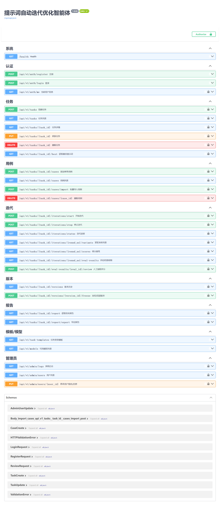

# 实训05 后端开发

## 一、实训目标

1. 掌握基于 FastAPI + SQLAlchemy 2.0 的 RESTful API 后端开发流程
2. 理解 LangGraph 状态图在「迭代式提示词优化」与「多步骤工作流」中的编排作用
3. 学会封装 OpenAI 兼容 LLM 客户端并处理超时、重试与脱敏
4. 掌握 BLEU / ROUGE / 关键词命中 / 格式合规等自动评估指标与 RAG 检索评测的实现
5. 能够独立启动后端服务并跑通「注册登录 → 创建任务 → 迭代闭环 → 报告」及知识库 / 在线服务 / 模型评测 / 工作流 / 分享等扩展模块的完整链路

## 二、实训内容

### 1. 背景知识

本项目是「提示词自动迭代优化智能体」的后端服务，核心能力是**自动为任务生成提示词变体，通过执行测试用例并评估得分，在若干轮迭代中择优更新最优提示词**。技术栈：

- **Web 框架**：FastAPI + Uvicorn（异步 ASGI 服务器）
- **编排引擎**：LangGraph 状态图（生成→执行→评估→择优→终止；多步骤工作流编排与步骤优化）
- **ORM**：SQLAlchemy 2.0，数据库使用 SQLite（sqlite3 库）
- **认证**：JWT（python-jose）+ bcrypt 密码哈希（passlib），登录失败锁定（IP+邮箱 5 次锁 15 分钟）
- **LLM 访问**：httpx 异步客户端，兼容 OpenAI Chat Completions 协议
- **自动指标**：NLTK（BLEU）、rouge 库（ROUGE-L）+ 自实现关键词/格式/单测指标
- **RAG 检索**：嵌入向量（OpenAI 兼容 embeddings）/ 词法指纹双模式检索 + 来源支撑度与忠实度评测
- **在线服务**：端点快照发布、`X-Api-Key` 鉴权（HMAC 恒定时间比较）、按端点限流、调用日志与统计
- **测试**：pytest（单元 / 接口 / E2E / RAG / 工作流 / 在线服务 / 分享 等 13 个文件）

服务默认端口 8000，API 统一基础路径 `/api/v1`，交互式接口文档内置 `/docs`。

### 2. 项目结构

```
d:\trae_project\提示词自动迭代优化智能体\01.code\prompt_optimizer\backend
├── requirements.txt          # 依赖清单
├── .env                      # 环境变量（LLM key、JWT 密钥、RAG 配置等）
├── .env.example              # 配置模板示例
├── app/
│   ├── main.py               # FastAPI 入口：建表、挂载路由、异常处理
│   ├── core/
│   │   ├── config.py         # 配置集中管理（pydantic-settings）
│   │   ├── security.py       # JWT 签发 / 校验 + API 密钥 HMAC 比较
│   │   ├── deps.py           # 依赖注入（get_db / get_current_user）
│   │   ├── exceptions.py     # 业务异常
│   │   └── progress.py       # 迭代进度追踪（前端轮询数据源）
│   ├── api/v1/
│   │   ├── api.py            # 路由汇总挂载
│   │   └── endpoints/        # 各模块接口
│   │       ├── auth.py       # 认证（登录失败锁定）
│   │       ├── tasks.py      # 任务
│   │       ├── cases.py      # 测试用例
│   │       ├── iterations.py # 迭代执行（后台任务 + 断点续跑）
│   │       ├── versions.py   # 版本 / 冻结 / 回退
│   │       ├── report.py     # 报告
│   │       ├── templates.py  # 任务模板
│   │       ├── admin.py      # 管理员
│   │       ├── knowledge.py  # 知识库（RAG 建库/语料/检索/评测）
│   │       ├── online.py     # 在线服务（端点/密钥/日志/统计/限流）
│   │       ├── benchmarks.py # 模型评测平台（多模型对比）
│   │       ├── workflows.py  # 多步骤工作流（编排/执行/步骤优化）
│   │       ├── report_shares.py # 报告分享（token 链接）
│   │       └── dashboard.py  # 仪表盘统计
│   ├── models/               # SQLAlchemy 模型（22 张表）
│   │   ├── user.py / task.py / test_case.py
│   │   ├── prompt_version.py / iteration.py / variant.py
│   │   ├── eval_result.py / operation_log.py
│   │   ├── knowledge.py      # knowledge_bases / knowledge_docs / knowledge_chunks
│   │   ├── endpoint.py       # service_endpoints / endpoint_call_logs
│   │   ├── benchmark.py      # benchmark_runs / benchmark_results
│   │   ├── workflow.py       # workflows / workflow_steps / workflow_runs /
│   │   │                     # workflow_results / workflow_step_optimizations / workflow_step_opt_variants
│   │   └── report_share.py   # report_shares
│   ├── schemas/              # Pydantic 请求/响应模型
│   ├── services/             # 业务服务层
│   │   ├── auth_service.py
│   │   ├── task_service.py
│   │   ├── case_service.py
│   │   ├── variant_generator.py       # 变体生成
│   │   ├── executor.py                # 批量执行
│   │   ├── metrics_service.py         # 自动指标
│   │   ├── judge_service.py           # 评审打分
│   │   ├── optimizer_orchestrator.py  # LangGraph 编排（核心）
│   │   ├── report_service.py
│   │   ├── rag_service.py             # RAG 检索 + 评测
│   │   ├── endpoint_service.py        # 在线端点 / 密钥 / 限流
│   │   ├── benchmark_service.py       # 模型评测
│   │   ├── workflow_executor.py       # 工作流链式执行
│   │   ├── workflow_step_optimizer.py # 步骤级多轮优化
│   │   ├── share_service.py           # 分享链接生成 / 校验
│   │   └── dashboard_service.py       # 仪表盘统计（SQL 聚合）
│   ├── llm/
│   │   └── client.py         # LLM 客户端封装（重试/退避/脱敏）
│   ├── db/
│   │   ├── base.py           # Base + engine + SessionLocal
│   │   └── init_db.py        # 建表
│   └── static/               # 前端构建产物（部署时托管）
├── tests/                    # pytest 测试（13 文件，共 91 项）
│   ├── conftest.py
│   ├── helpers.py
│   ├── test_auth_api.py / test_task_case_api.py / test_metrics.py
│   ├── test_iteration_e2e.py / test_llm_retry.py / test_orchestrator_retry.py
│   ├── test_rag.py / test_online.py / test_benchmark.py / test_normalize.py
│   ├── test_workflow.py / test_dashboard.py / test_report_shares.py
├── scripts/                  # 辅助脚本
│   ├── capture_shots.py      # 截图采集
│   ├── diag_login.py         # 登录诊断
│   └── perf_smoke.py         # 性能冒烟
└── prompt_optimizer.db       # SQLite 数据库文件（运行时生成）
```

## 三、实训步骤

### 步骤1：检查 Python 环境（要求 3.12+）

**操作命令：**
```bash
cd /d/trae_project/提示词自动迭代优化智能体/01.code/prompt_optimizer/backend
# 本实训环境为 Windows PowerShell；先检查 Python 版本
python --version
```

**验证方法：**
```powershell
# 输出版本号，确认 Python 3.12 及以上
python --version | Select-String "3.12"
# 预期输出：匹配行，如 Python 3.12.2
```

**成功标志：**
- 输出版本号且为 3.12+
- `pip` 可用

### 步骤2：安装后端依赖

**操作命令：**
```powershell
cd "d:\trae_project\提示词自动迭代优化智能体\01.code\prompt_optimizer\backend"
pip install -r requirements.txt
```

依赖清单内容（`requirements.txt`）：
```
fastapi>=0.141
uvicorn[standard]>=0.30
langgraph>=1.2
sqlalchemy>=2.0.30
pydantic>=2.7
python-jose[cryptography]>=3.3
passlib[bcrypt]>=1.7
httpx>=0.27
python-multipart>=0.0.9
nltk>=3.8
rouge>=1.0
```

**验证方法：**
```powershell
# 逐项检查核心包已安装
pip show fastapi | Select-String "Name|Version"
pip show uvicorn | Select-String "Version"
pip show langgraph | Select-String "Version"
pip show sqlalchemy | Select-String "Version"
```

**成功标志：**
- 所有依赖安装成功，无版本冲突
- `pip show langgraph` 能查到版本（新版命名可能为 `langchain-core`，注意兼容）

### 步骤3：配置环境变量 .env

**操作命令：**

复制 `.env.example` 为 `.env`，填写真实配置：
```powershell
# 复制模板（PowerShell）
Copy-Item ".env.example" ".env"
```

`.env.example` 参考内容：
```ini
# ============ 提示词自动迭代优化智能体 · 后端环境配置 ============

# JWT 签名密钥（务必替换为随机长字符串）
JWT_SECRET_KEY=change-me-to-a-long-random-secret
JWT_ALGORITHM=HS256
JWT_EXPIRE_MINUTES=1440

# 登录态 Cookie：公网 HTTPS 生产环境置 True；本机/内网 HTTP 保持 False
COOKIE_SECURE=false

# LLM API（OpenAI 兼容，国内直连）
# 形如 https://dashscope.aliyuncs.com/compatible-mode/v1
LLM_BASE_URL=
LLM_API_KEY=
LLM_DEFAULT_MODEL=qwen-plus

# 数据库文件路径（相对 backend 目录）
DATABASE_URL=sqlite:///./prompt_optimizer.db

# 迭代执行默认参数
VARIANT_GEN_TEMPERATURE=0.8
EXEC_TIMEOUT_SECONDS=60
EXEC_MAX_RETRIES=2

# RAG 检索增强
# 嵌入模型名，留空则用本地词法检索；可填 BAAI/bge-m3 等 OpenAI 兼容 embeddings 模型
EMBED_MODEL=
# 一键导入示例语料库目录（绝对路径）
RAG_CORPUS_DIR=
# 评测执行时默认注入的检索块数
RAG_EVAL_TOP_K=4
```

**注意**：`LLM_BASE_URL` 与 `LLM_API_KEY` 必须填写真实值，否则迭代时无法调用大模型（但登录/建任务等基础接口仍可用）。

**验证方法：**
```powershell
Test-Path "d:\trae_project\提示词自动迭代优化智能体\01.code\prompt_optimizer\backend\.env"
# 预期输出: True

Get-Content "d:\trae_project\提示词自动迭代优化智能体\01.code\prompt_optimizer\backend\.env" | Select-String "LLM_API_KEY"
# 预期输出: 包含已填写的 key
```

**成功标志：**
- `.env` 文件存在且关键项已填写
- 切勿将 `.env` 提交到 git（含密钥）

### 步骤4：初始化 / 迁移 SQLite 数据库

数据库采用 SQLAlchemy 2.0 ORM，`init_db` 在应用启动时自动建表（`create_all`，幂等操作）。

```python
# d:\trae_project\提示词自动迭代优化智能体\01.code\prompt_optimizer\backend\app\db\init_db.py
from app.db.base import Base, engine
from app import models  # 确保模型已注册

def init_db() -> None:
    """创建所有数据表。幂等操作，可重复调用。"""
    Base.metadata.create_all(bind=engine)
```

`main.py` 在启动时调用 `init_db()`：
```python
from app.main import app  # 只需 import 即可触发初始化
```

**操作命令**：直接运行后端即可自动建表（见下一步）。

**验证方法（建表完整性）：**
```powershell
# 若已启动过后端，检查 sqlite 数据库文件是否存在
Test-Path "d:\trae_project\提示词自动迭代优化智能体\01.code\prompt_optimizer\backend\app\prompt_optimizer.db"
# 预期输出: True
```

**成功标志：**
- 数据库文件生成，表结构完整
- 重复启动不会报错（create_all 幂等）

### 步骤5：启动后端服务 Uvicorn

**操作命令：**
```powershell
cd "d:\trae_project\提示词自动迭代优化智能体\01.code\prompt_optimizer\backend"
uvicorn app.main:app --reload --port 8000
```

**验证方法（新窗口）：**
```powershell
# 健康检查
Invoke-RestMethod -Uri "http://localhost:8000/health" -Method GET | ConvertTo-Json
# 预期输出: {"code":0,"message":"success","data":{"status":"ok",...}}
```

**成功标志：**
- 服务启动无异常
- `/health` 返回 `code=0` 与 `status=ok`

### 步骤6：验证 /docs 接口文档

访问 `http://localhost:8000/docs` 查看 Swagger 交互式接口文档，可在线调试所有接口。



**验证**：
- 页面列出全部接口路由（auth/tasks/cases/iterations/versions/report/templates/admin + knowledge/online/benchmarks/workflows/report_shares/dashboard）
- 点击 `POST /api/v1/auth/register` 可展开并在线测试
- 文档基于 FastAPI + Pydantic 自动生成

**成功标志：**
- Swagger 文档加载正常，接口说明完整
- 可在线调用接口调试

### 步骤7：验证注册与登录接口

通过 `/docs` 或命令行调用认证接口。

`app/api/v1/endpoints/auth.py` 接口实现：
```python
# ==========================================================
# 认证接口：注册 / 登录 / 当前用户
# ==========================================================
from fastapi import APIRouter, Depends
from sqlalchemy.orm import Session

from app.core.deps import get_current_user
from app.db.base import get_db
from app.models import User
from app.schemas.auth import LoginRequest, LoginResponse, RegisterRequest, UserOut
from app.services import auth_service

router = APIRouter(prefix="/auth", tags=["认证"])

@router.post("/register", summary="注册")
def register(body: RegisterRequest, db: Session = Depends(get_db)):
    user = auth_service.register(db, body.email, body.password, body.full_name)
    return {"code": 0, "message": "success", "data": UserOut.model_validate(user).model_dump()}

@router.post("/login", summary="登录")
def login(body: LoginRequest, db: Session = Depends(get_db)):
    user, token = auth_service.login(db, body.email, body.password)
    data = LoginResponse(token=token, user=UserOut.model_validate(user)).model_dump()
    return {"code": 0, "message": "success", "data": data}
```

**操作命令（PowerShell 调用登录）：**
```powershell
# 构造注册请求体
$body = @{ email = "test@example.com"; password = "password123"; full_name = "实训学员" } | ConvertTo-Json

# 调用注册接口
Invoke-RestMethod -Uri "http://localhost:8000/api/v1/auth/register" -Method POST -ContentType "application/json" -Body $body | ConvertTo-Json

# 调用登录接口
$loginBody = @{ email = "test@example.com"; password = "password123" } | ConvertTo-Json
$resp = Invoke-RestMethod -Uri "http://localhost:8000/api/v1/auth/login" -Method POST -ContentType "application/json" -Body $loginBody
$resp | ConvertTo-Json
```

**验证方法：**
```powershell
# 提取 token
$token = $resp.data.token

# 用 token 访问 /auth/me 验证鉴权
Invoke-RestMethod -Uri "http://localhost:8000/api/v1/auth/me" -Method GET -Headers @{ Authorization = "Bearer $token" } | ConvertTo-Json
# 预期输出: data 中包含当前用户信息 email=test@example.com，role=user
```

**成功标志：**
- 注册返回 `code=0`，用户创建成功
- 登录返回 token，`/auth/me` 能通过 JWT 鉴权读取用户信息
- 未携带 token 时 `/auth/me` 返回 `code=401`

### 步骤8：用 LangGraph 跑通「变体生成 → 执行 → 评估 → 择优」闭环

核心编排位于 `app/services/optimizer_orchestrator.py`，以 LangGraph 状态图组织迭代循环。

```
┌─────────┐      ┌─────────┐      ┌─────────┐      ┌─────────┐
│ 生成变体  │ ──▶ │ 执行+评估 │ ──▶ │ 择优更新  │ ──▶ │ 终止判断  │
└────┬────┘      └─────────┘      └─────────┘      └────┬────┘
     │ gen                                              │ decide
     └────────────────── 条件边：未终止则回到 gen ◀──────┘
                终止（达标/最大轮次/滞涨/停止）→ END
```

四个节点：
1. **gen（生成变体）**：基于当前最优提示词 + 失败案例调用 LLM 生成多个变体
2. **eval（执行 + 评估）**：变体 × 用例并发执行，计算自动指标 + 评审打分 + 合成综合得分
3. **update（择优更新）**：将本轮最优写入任务/版本库，判断滞涨
4. **decide（终止判断）**：判定继续或终止，并路由回 `gen` 或 `end`

状态图构建代码：
```python
# ==========================================================
# LangGraph 迭代编排器
# ==========================================================
from langgraph.graph import StateGraph

class OptimizationState(TypedDict):
    task_id: int
    round: int              # 当前轮（1-based）
    base_prompt: str        # 本轮基准提示词
    best_score: float       # 当前最优综合得分
    fail_cases: list[dict]  # 上一轮低分案例
    stop_flag: bool         # 是否应停止
    t: int                  # 连续滞涨轮数
    terminating: str | None # 终止原因

def build_optimization_graph():
    """构造 LangGraph 状态图。"""
    graph = StateGraph(OptimizationState)
    graph.add_node("gen", _gen_variants)          # 节点1：生成变体
    graph.add_node("eval", _execute_and_eval)     # 节点2：执行+评估
    graph.add_node("update", _update_best)        # 节点3：择优更新
    graph.add_node("decide", _decide)             # 节点4：终止判断
    graph.set_entry_point("gen")
    graph.add_edge("gen", "eval")
    graph.add_edge("eval", "update")
    graph.add_edge("update", "decide")
    # 条件边：decide 之后按终止判定路由回 gen 或结束
    graph.add_conditional_edges("decide", _route, {"gen": "gen", "end": "__end__"})
    return graph.compile()
```

**操作命令（创建任务并发起迭代）：**
```powershell
# 用 token 创建任务
$taskBody = @{
  name = "电商文案生成优化"
  task_type = "text_gen"
  description = "根据商品信息生成吸引人的电商文案"
  objective = "提升点击率与转化意图"
  criteria = "文案需包含卖点、使用场景、行动号召"
  execution_model = "qwen-plus"
  judge_model = "qwen-plus"
  target_score = 85
  max_rounds = 5
  variants_per_round = 3
  concurrency = 1
} | ConvertTo-Json
$taskResp = Invoke-RestMethod -Uri "http://localhost:8000/api/v1/tasks" -Method POST -Headers @{ Authorization = "Bearer $token" } -ContentType "application/json" -Body $taskBody
$taskResp | ConvertTo-Json
$taskId = $taskResp.data.id

# 添加一条测试用例
$caseBody = @{ input_text = "商品：无线蓝牙耳机，卖点：降噪、长续航24小时、防水"; keywords = @("降噪","续航","防水") } | ConvertTo-Json
Invoke-RestMethod -Uri "http://localhost:8000/api/v1/tasks/$taskId/cases" -Method POST -Headers @{ Authorization = "Bearer $token" } -ContentType "application/json" -Body $caseBody | ConvertTo-Json

# 发起迭代（后台异步执行）
Invoke-RestMethod -Uri "http://localhost:8000/api/v1/tasks/$taskId/iterations/start" -Method POST -Headers @{ Authorization = "Bearer $token" } | ConvertTo-Json
```

**验证方法（查询进度）：**
```powershell
# 每 1.5 秒轮询迭代状态
1..20 | ForEach-Object {
  $st = Invoke-RestMethod -Uri "http://localhost:8000/api/v1/tasks/$taskId/iterations/status" -Method GET -Headers @{ Authorization = "Bearer $token" }
  Write-Output (($st.data | ConvertTo-Json -Compress))
  if ($st.data.task_status -ne 'running') { break }
  Start-Sleep -Milliseconds 1500
}

# 任务完成后查询最优提示词
Invoke-RestMethod -Uri "http://localhost:8000/api/v1/tasks/$taskId" -Method GET -Headers @{ Authorization = "Bearer $token" } | ConvertTo-Json
# 预期: data 含 best_prompt 与新增的 best_score/current_round
```

**成功标志：**
- 迭代接口立即返回，后端异步执行
- 状态轮询显示 `current_round`、`variants_done`、`cases_done` 逐步推进
- 任务最终状态为 `completed`，`best_prompt`、`best_score` 已更新（需配置 LLM key）

### 步骤9：验证 BLEU / ROUGE / 关键词评估实现

自动指标服务位于 `app/services/metrics_service.py`，各指标归一化到 0-100，无参考输出时自动跳过。

```python
# ==========================================================
# 自动指标服务：BLEU / ROUGE / 关键词命中 / 格式合规
# ==========================================================
def _compute_bleu(output: str, reference: str) -> float | None:
    """BLEU 得分（0-100）。无 nltk 时用简化 n-gram 精确率兜底。"""
    if not reference:
        return None
    hyp = _tokenize(output)
    ref = _tokenize(reference)
    if _NLTK_OK:
        try:
            score = sentence_bleu([ref], hyp, weights=(0.5, 0.5),
                                  smoothing_function=SmoothingFunction().method1)
            return round(min(1.0, score) * 100, 2)
        except Exception:
            pass
    # 简化兜底：1/2-gram 重叠精确率
    ...

def _compute_keyword_hit(output: str, keywords: list[str]) -> float | None:
    """关键词命中率：命中数 / 总数 × 100。"""
    if not keywords:
        return None
    if not output:
        return 0.0
    hit = sum(1 for kw in keywords if kw in output)
    return round(hit / len(keywords) * 100, 2)

def compute_metrics(task_type, output, reference, keywords, run_test) -> MetricResult:
    """计算单个用例的全部自动指标。"""
    res = MetricResult()
    res.format_ok = _compute_format_ok(task_type, output)
    res.keyword_hit = _compute_keyword_hit(output or "", keywords or [])
    res.bleu = _compute_bleu(output or "", reference or "") if reference else None
    res.rouge = _compute_rouge(output or "", reference or "") if reference else None
    # 代码类任务：单测通过率
    if task_type == "code" and run_test:
        res.unit_pass_rate = _compute_unit_test_pass(output or "", run_test)
    return res
```

**操作命令（Python 验证指标）：**
```powershell
# 用 python 直接验证指标函数（需先进入 backend 目录并安装依赖）
cd "d:\trae_project\提示词自动迭代优化智能体\01.code\prompt_optimizer\backend"
python -c "
from app.services.metrics_service import compute_metrics
m = compute_metrics('text_gen', '这款耳机降噪效果出色，续航24小时，支持防水',
                    '这款耳机降噪出色，续航长，防水', ['降噪','防水'], None)
print('bleu=', m.bleu, 'rouge=', m.rouge, 'keyword_hit=', m.keyword_hit, 'format_ok=', m.format_ok)
"
```

**验证方法：**
```powershell
# 检查 metrics_service.py 存在
Test-Path "d:\trae_project\提示词自动迭代优化智能体\01.code\prompt_optimizer\backend\app\services\metrics_service.py"
# 预期输出: True

# 运行 pytest 指标单测（可选）
cd "d:\trae_project\提示词自动迭代优化智能体\01.code\prompt_optimizer\backend"
python -m pytest tests/test_metrics.py -q
```

**成功标志：**
- 指标函数可被调用并返回合理数值（0-100）
- 含关键词"降噪""防水"时 `keyword_hit` 较高
- pytest 指标测试通过

### 步骤10：生成优化报告

报告接口根据迭代记录生成结构化报告，包含得分曲线、版本差异、评审汇总与优化建议，支持导出 Markdown/JSON。

**操作命令：**
```powershell
# 获取报告
Invoke-RestMethod -Uri "http://localhost:8000/api/v1/tasks/$taskId/report" -Method GET -Headers @{ Authorization = "Bearer $token" } | ConvertTo-Json

# 导出 Markdown 报告到本地文件
$report = Invoke-WebRequest -Uri "http://localhost:8000/api/v1/tasks/$taskId/report/export?format=markdown" -Method GET -Headers @{ Authorization = "Bearer $token" }
$report.Content | Out-File -FilePath ".\report_task_$taskId.md" -Encoding utf8
```

**验证方法：**
```powershell
Test-Path ".\report_task_$taskId.md"
# 预期输出: True

Get-Content ".\report_task_$taskId.md" | Select-String "best_prompt\|score_curve\|建议"
# 预期输出: 报告包含关键内容
```

**成功标志：**
- `/report` 返回结构化的报告 JSON
- `/report/export` 能导出 Markdown 文件并保存成功

### 步骤11：验证知识库（RAG）接口

知识库模块提供建库、语料上传（单条/批量）、一键导入示例语料目录、检索预览与 RAG 检索+生成评测。

```powershell
# 创建知识库
$kbBody = @{ name = "电商知识库"; description = "产品手册语料" } | ConvertTo-Json
$kb = Invoke-RestMethod -Uri "http://localhost:8000/api/v1/knowledge-bases" -Method POST -Headers @{ Authorization = "Bearer $token" } -ContentType "application/json" -Body $kbBody
$kbId = $kb.data.id

# 上传一条语料文档
$docBody = @{ title = "耳机说明书"; content = "本产品支持主动降噪，续航 24 小时，IPX7 防水……" } | ConvertTo-Json
Invoke-RestMethod -Uri "http://localhost:8000/api/v1/knowledge-bases/$kbId/docs" -Method POST -Headers @{ Authorization = "Bearer $token" } -ContentType "application/json" -Body $docBody | ConvertTo-Json

# 检索预览（top_k 默认 4）
$retBody = @{ query = "降噪耳机续航多久"; top_k = 4 } | ConvertTo-Json
Invoke-RestMethod -Uri "http://localhost:8000/api/v1/knowledge-bases/$kbId/retrieve" -Method POST -Headers @{ Authorization = "Bearer $token" } -ContentType "application/json" -Body $retBody | ConvertTo-Json

# RAG 检索+生成评测（来源支撑度 / 忠实度 0-100）
$evBody = @{ query = "降噪耳机续航多久"; top_k = 4 } | ConvertTo-Json
Invoke-RestMethod -Uri "http://localhost:8000/api/v1/knowledge-bases/$kbId/evaluate" -Method POST -Headers @{ Authorization = "Bearer $token" } -ContentType "application/json" -Body $evBody | ConvertTo-Json
```

**成功标志：**
- 建库/上传后 `doc_count`、`chunk_count` 随上传正确自增
- 检索返回命中的知识块；未配置 `EMBED_MODEL` 时自动降级词法指纹检索
- 评测返回生成答案与来源支撑度、忠实度评分

### 步骤12：验证在线服务接口

在线服务把任务的最优提示词快照发布为端点，使用 `X-Api-Key` 鉴权调用（仅 POST），按端点限流 60 次/分钟。

```powershell
# 创建端点（绑定任务，快照其最优提示词）
$epBody = @{ task_id = $taskId; name = "文案生成API"; model = "qwen-plus" } | ConvertTo-Json
$ep = Invoke-RestMethod -Uri "http://localhost:8000/api/v1/endpoints" -Method POST -Headers @{ Authorization = "Bearer $token" } -ContentType "application/json" -Body $epBody
$epId = $ep.data.id
$apiKey = $ep.data.api_key        # 创建时返回 sk- 明文（仅此一次）

# 用密钥调用端点（X-Api-Key 鉴权）
$invBody = @{ input_text = "无线蓝牙耳机，卖点降噪/长续航/防水" } | ConvertTo-Json
Invoke-RestMethod -Uri "http://localhost:8000/api/v1/endpoints/$epId/invoke" -Method POST -Headers @{ "X-Api-Key" = $apiKey } -ContentType "application/json" -Body $invBody | ConvertTo-Json

# 查看调用日志与统计
Invoke-RestMethod -Uri "http://localhost:8000/api/v1/endpoints/$epId/logs?page=1&page_size=10" -Method GET -Headers @{ Authorization = "Bearer $token" } | ConvertTo-Json
Invoke-RestMethod -Uri "http://localhost:8000/api/v1/endpoints/$epId/stats" -Method GET -Headers @{ Authorization = "Bearer $token" } | ConvertTo-Json

# 密钥轮换（旧密钥立即失效）
Invoke-RestMethod -Uri "http://localhost:8000/api/v1/endpoints/$epId/rotate-key" -Method POST -Headers @{ Authorization = "Bearer $token" } | ConvertTo-Json
```

**成功标志：**
- 创建端点返回 `sk-` 密钥，调用能拿到模型回复
- 错误/缺失密钥返回 401；超频调用返回 429 限流
- 日志与统计正确记录每次调用（SQL 原子计数）

### 步骤13：验证模型评测平台接口

模型评测对同一任务的最优/初始/自定义提示词发起多模型对比评测，产出得分矩阵与推荐模型。

```powershell
# 发起评测（多模型 × 用例）
$bmBody = @{
  task_id = $taskId
  prompt_source = "best"        # best / initial / custom
  custom_prompt = ""            # prompt_source=custom 时必填
  models = @("qwen-plus", "deepseek-ai/DeepSeek-V4-Flash")
} | ConvertTo-Json
$bm = Invoke-RestMethod -Uri "http://localhost:8000/api/v1/benchmarks" -Method POST -Headers @{ Authorization = "Bearer $token" } -ContentType "application/json" -Body $bmBody
$bmId = $bm.data.id

# 查询评测结果（模型 × 用例得分矩阵）
Invoke-RestMethod -Uri "http://localhost:8000/api/v1/benchmarks/$bmId" -Method GET -Headers @{ Authorization = "Bearer $token" } | ConvertTo-Json

# 导出评测报告（Markdown）
Invoke-RestMethod -Uri "http://localhost:8000/api/v1/benchmarks/$bmId/export?format=markdown" -Method GET -Headers @{ Authorization = "Bearer $token" } | ConvertTo-Json
```

**成功标志：**
- 评测运行后返回各模型 × 用例得分矩阵与平均分
- `recommended_model` 为平均分最高的模型
- 报告可导出为 Markdown

### 步骤14：验证多步骤工作流接口

工作流将任务拆分为多个步骤链式执行，每步含指令模板（`{{input}}` / `{{stepN.out}}` 占位符），支持步骤级多轮优化。

```powershell
# 创建双步骤工作流
$wfBody = @{
  name = "文案+改写工作流"
  steps = @(
    @{ name = "初稿生成"; instruction = "根据{{input}}生成电商文案初稿" },
    @{ name = "润色改写"; instruction = "把{{step1.out}}润色得更吸引人，输出最终文案" }
  )
} | ConvertTo-Json
$wf = Invoke-RestMethod -Uri "http://localhost:8000/api/v1/workflows" -Method POST -Headers @{ Authorization = "Bearer $token" } -ContentType "application/json" -Body $wfBody
$wfId = $wf.data.id

# 执行工作流
Invoke-RestMethod -Uri "http://localhost:8000/api/v1/workflows/$wfId/runs" -Method POST -Headers @{ Authorization = "Bearer $token" } | ConvertTo-Json

# 查询运行历史
Invoke-RestMethod -Uri "http://localhost:8000/api/v1/workflows/$wfId/runs?page=1&page_size=10" -Method GET -Headers @{ Authorization = "Bearer $token" } | ConvertTo-Json

# 对第 1 步发起步骤优化（轮次 2）
Invoke-RestMethod -Uri "http://localhost:8000/api/v1/workflows/$wfId/steps/1/optimize" -Method POST -Headers @{ Authorization = "Bearer $token" } -ContentType "application/json" -Body (@{ rounds = 2 } | ConvertTo-Json) | ConvertTo-Json
```

**成功标志：**
- 工作流创建成功，链式执行时各步骤输出正确串联（`{{stepN.out}}` 解析生效）
- 运行历史展示每步结果与基线对照评测
- 步骤优化到达最大轮次或连续两轮无改进时提前终止

### 步骤15：验证报告分享接口

优化报告 / 评测报告 / 工作流报告可生成带 token 的免登录分享链接，支持有效期与撤销。

```powershell
# 为任务报告创建分享链接（7 天有效）
$shareBody = @{ report_type = "task"; report_id = $taskId; expires_in_days = 7 } | ConvertTo-Json
$share = Invoke-RestMethod -Uri "http://localhost:8000/api/v1/report-shares" -Method POST -Headers @{ Authorization = "Bearer $token" } -ContentType "application/json" -Body $shareBody
$token2 = $share.data.token

# 免登录访问公开报告（无需 Authorization 头）
Invoke-RestMethod -Uri "http://localhost:8000/api/v1/public/reports/$token2" -Method GET | ConvertTo-Json

# 撤销分享
Invoke-RestMethod -Uri "http://localhost:8000/api/v1/report-shares/$($share.data.id)" -Method DELETE -Headers @{ Authorization = "Bearer $token" } | ConvertTo-Json
```

**成功标志：**
- 分享链接在有效期内可免登录读取报告
- 撤销后访问返回 404 / 失效提示

### 步骤16：验证仪表盘统计接口

仪表盘接口以 SQL 聚合返回资产总览与趋势，前端据此渲染统计卡与图表。

```powershell
# 资产总览（任务/知识库/端点/分享数量、模型分布等）
Invoke-RestMethod -Uri "http://localhost:8000/api/v1/dashboard/overview" -Method GET -Headers @{ Authorization = "Bearer $token" } | ConvertTo-Json

# 近 7 天趋势（含当天）
Invoke-RestMethod -Uri "http://localhost:8000/api/v1/dashboard/trend?days=7" -Method GET -Headers @{ Authorization = "Bearer $token" } | ConvertTo-Json
```

**成功标志：**
- 统计值由 SQL 聚合得出（非内存计算），与数据库实际记录一致
- `trend` 返回指定天数（含当天）的逐日数据

### 步骤17：运行后端测试（pytest）

**操作命令：**
```powershell
cd "d:\trae_project\提示词自动迭代优化智能体\01.code\prompt_optimizer\backend"
python -m pytest -q
```

**验证方法：**
```powershell
python -m pytest tests/ -q
# 预期输出: 91 passed（13 个测试文件：单元/接口/E2E/LLM 重试/RAG/在线服务/评测/工作流/分享/仪表盘）
```

**成功标志：**
- 认证 API、任务/用例 API、指标、迭代端到端、RAG、在线服务、模型评测、工作流、分享、仪表盘等测试全部通过
- 无失败（failed）或无错误（error）

## 四、验证清单

完成所有步骤后，请逐一核对：

| 验证项 | 验证方法 | 预期结果 |
|--------|----------|----------|
| Python 版本 | `python --version` | 3.12+ |
| 依赖安装 | `pip show fastapi/langgraph` | 显示版本信息 |
| 环境配置 | `Test-Path .env` | True |
| 数据库初始化 | `Test-Path prompt_optimizer.db` | True |
| 服务启动 | `Invoke-RestMethod /health` | `code=0,status=ok` |
| Swagger 文档 | 浏览器访问 /docs | 接口列表完整可调试 |
| 注册/登录 | POST /auth/register、/auth/login | 返回 token |
| JWT 鉴权 | GET /auth/me 带 token | 返回用户信息 |
| 迭代闭环 | 建任务→加用例→start→轮询 status | 状态推进至 completed |
| 自动指标 | python 调用 compute_metrics | 返回 0-100 合理值 |
| 报告生成 | GET /report、导出 | 报告内容完整且可导出 |
| 知识库 RAG | POST /knowledge-bases 建库/上传/检索/评测 | doc_count 自增、检索命中、评分 0-100 |
| 在线服务 | 建端点→X-Api-Key 调用→日志/统计/轮换 | 调用成功、401/429 拦截生效 |
| 模型评测 | POST /benchmarks 发起→查询矩阵→导出 | 得分矩阵 + recommended_model |
| 多步骤工作流 | 建工作流→执行→查历史→步骤优化 | 链式串联、步骤优化终止正常 |
| 报告分享 | POST /report-shares → 免登录访问 → 撤销 | 有效期内可读、撤销后失效 |
| 仪表盘 | GET /dashboard/overview、/trend | SQL 聚合统计与趋势正确 |
| pytest 测试 | `python -m pytest -q` | 91 passed，全部通过 |

## 五、故障排除

### 问题1：uvicorn 启动报错 `ModuleNotFoundError`

**现象：** 缺少某个包（如 pydantic_settings、langgraph）。

**解决方案：**
```powershell
# 补装缺失依赖
pip install -r requirements.txt

# 若 requirements 缺少 pydantic-settings，单独安装
pip install pydantic-settings
# 确保 langgraph 正确安装（新版本可能拆分依赖）
pip install langgraph langchain-core
```

### 问题2：/health 正常，但 /auth/* 提示 `Internal Server Error`（1006）

**现象：** 认证接口返回 `code=1006`。

**可能原因与解决方案：**
1. 数据库未初始化 / 无权限写文件：确认 backend 目录可写且 sqlite 文件可创建
2. `auth_service` 抛异常：查看后端控制台堆栈，常见为 `passlib` / `python-jose` 版本兼容问题
3. 端口冲突导致 app 启动异常：先停止占用进程

### 问题3：迭代 start 后一直 `running`，无任何进展

**现象：** 创建任务并 start 后，状态始终 running，得分不更新。

**可能原因与解决方案：**
1. 未配置 `LLM_API_KEY` 与 `LLM_BASE_URL`：检查 `.env`，必须填写真实可用的 key
2. 任务无测试用例：确认通过 `POST /tasks/{id}/cases` 添加了至少 1 条用例（否则迭代报错）
3. LLM 调用超时/限流：检查 `EXEC_TIMEOUT_SECONDS` 与 `EXEC_MAX_RETRIES` 配置
4. base_url 格式错误：应为 OpenAI 兼容端点形如 `https://.../compatible-mode/v1`

### 问题4：任务 status 变为 `failed`

**现象：** 迭代异常被捕获，任务被标记 failed，`last_error` 有信息。

**解决方案：**
- 查看 GET /tasks/{id} 返回的 `last_error` 字段定位根因
- 检查后端控制台 `orchestrator` 日志堆栈
- 常见原因：LLM key 无效、模型不支持 JSON 输出、并发过高触发限流

### 问题5：`ImportError: cannot import name 'StateGraph'`

**现象：** LangGraph API 变更导致导入失败。

**解决方案：**
```powershell
# 升级 langgraph 到最新稳定版，新 API 为 langgraph.graph.StateGraph
pip install -U langgraph
# 若项目采用 build_graph 风格，则迁移为 StateGraph 构建，参考本实训 optimizer_orchestrator.py
```

## 六、参考代码

### 完整目录树（后端）

```
d:\trae_project\提示词自动迭代优化智能体\01.code\prompt_optimizer\backend
├── requirements.txt
├── .env
├── .env.example
├── app/
│   ├── main.py
│   ├── core/
│   │   ├── config.py
│   │   ├── security.py
│   │   ├── deps.py
│   │   ├── exceptions.py
│   │   ├── progress.py
│   │   └── static_host.py
│   ├── api/
│   │   └── v1/
│   │       ├── api.py
│   │       └── endpoints/
│   │           ├── auth.py / tasks.py / cases.py
│   │           ├── iterations.py / versions.py
│   │           ├── report.py / templates.py / admin.py
│   │           ├── knowledge.py / online.py
│   │           ├── benchmarks.py / workflows.py
│   │           ├── report_shares.py / dashboard.py
│   ├── models/
│   │   ├── user.py / task.py / test_case.py
│   │   ├── prompt_version.py / iteration.py / variant.py
│   │   ├── eval_result.py / operation_log.py
│   │   ├── knowledge.py / endpoint.py
│   │   ├── benchmark.py / workflow.py / report_share.py
│   ├── schemas/
│   │   ├── auth.py / task.py / extra.py
│   ├── services/
│   │   ├── auth_service.py / task_service.py / case_service.py
│   │   ├── variant_generator.py / executor.py
│   │   ├── metrics_service.py / judge_service.py
│   │   ├── optimizer_orchestrator.py / report_service.py
│   │   ├── rag_service.py / endpoint_service.py
│   │   ├── benchmark_service.py / workflow_executor.py
│   │   ├── workflow_step_optimizer.py / share_service.py
│   │   └── dashboard_service.py
│   ├── llm/
│   │   └── client.py
│   ├── db/
│   │   ├── base.py
│   │   └── init_db.py
│   └── static/              # 前端构建产物（部署托管）
├── tests/
│   ├── conftest.py
│   ├── helpers.py
│   ├── test_auth_api.py / test_task_case_api.py / test_metrics.py
│   ├── test_iteration_e2e.py / test_llm_retry.py / test_orchestrator_retry.py
│   ├── test_rag.py / test_online.py / test_benchmark.py / test_normalize.py
│   ├── test_workflow.py / test_dashboard.py / test_report_shares.py
└── scripts/
    ├── capture_shots.py
    ├── diag_login.py
    └── perf_smoke.py
```

### 常用命令

```powershell
# 1. 进入后端目录
cd "d:\trae_project\提示词自动迭代优化智能体\01.code\prompt_optimizer\backend"

# 2. 安装依赖
pip install -r requirements.txt

# 3. 启动开发服务（热重载）
uvicorn app.main:app --reload --port 8000

# 4. 健康检查
Invoke-RestMethod -Uri "http://localhost:8000/health" -Method GET

# 5. 运行测试
python -m pytest -q

# 6. 生产启动（多 worker）
uvicorn app.main:app --host 0.0.0.0 --port 8000 --workers 2
```

### 关键配置说明

| 环境变量 | 说明 | 示例 |
|----------|------|------|
| `LLM_BASE_URL` | LLM 服务地址（OpenAI 兼容） | `https://api.siliconflow.cn/v1` |
| `LLM_API_KEY` | LLM 访问密钥 | 必填（迭代必需） |
| `LLM_DEFAULT_MODEL` | 默认模型 | `deepseek-ai/DeepSeek-V4-Flash` |
| `JWT_SECRET_KEY` | JWT 签名密钥 | 随机长字符串 |
| `JWT_EXPIRE_MINUTES` | token 有效期 | `1440` |
| `COOKIE_SECURE` | 登录态 Cookie 是否仅 HTTPS | 公网 HTTPS 置 `True` |
| `DATABASE_URL` | 数据库连接 | `sqlite:///./prompt_optimizer.db` |
| `EXEC_TIMEOUT_SECONDS` | 单次执行超时 | `60` |
| `EXEC_MAX_RETRIES` | 执行重试次数 | `2` |
| `EMBED_MODEL` | RAG 嵌入模型名（留空降级词法检索） | `BAAI/bge-m3` |
| `RAG_CORPUS_DIR` | 一键导入示例语料目录（绝对路径） | `d:\...\05.RAG语料` |
| `RAG_EVAL_TOP_K` | RAG 评测注入检索块数 | `4` |

---

**文档版本**：V1.0.0
**实训配套项目**：提示词自动迭代优化智能体